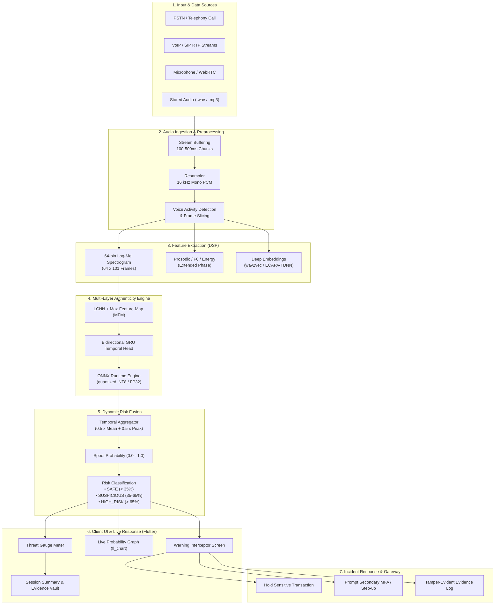
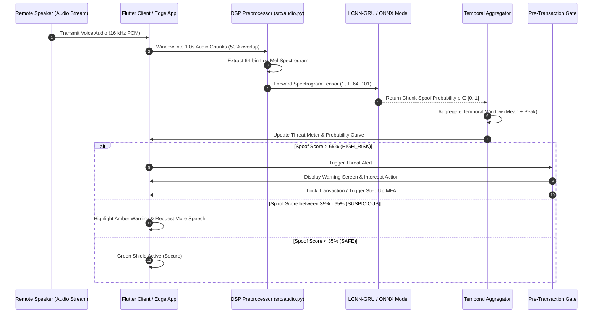

# VAANI-SHIELD (वाणी शील्ड)
### AI-Powered Real-Time Voice Clone Detection & Telephony Fraud Defense

VAANI-SHIELD is an enterprise-grade, real-time voice clone and synthetic speech detection system designed to protect contact centers, financial institutions, and edge users against deepfake audio and voice phishing attacks.

---

##  Architecture Comparison: Pitch Deck (PPT) vs. Implemented Solution

Below is a detailed layer-by-layer architectural comparison between the proposed **Target System (PPT)** and the **Current Implemented Prototype** in this repository.

| Layer / Component | Target Specification (From PPT Deck) | Current Implementation Status in Repo |
|---|---|---|
| **1. Input & Data Sources** | PSTN/Telephony, VoIP/SIP RTP streams, Teams/Zoom enterprise audio, reference voice samples, call metadata | **Implemented:** Live microphone streaming (`src/live_mic.py`, `src/live_gui.py`), file ingestion (`audio/test.wav`), real-time chunk buffer simulation (`src/realtime.py`), and Flutter mobile/web audio input channel. |
| **2. Real-Time Audio Ingestion** | WebRTC/SIP Gateway, Stream buffering, VAD, Noise suppression, Echo cancellation, 16 kHz PCM frames | **Implemented:** 16 kHz mono resampling, sliding-window chunking (1.0s chunks, 50% overlap), and stream aggregation buffers (`src/audio.py`, `src/aggregation.py`). |
| **3. Voice Feature Extraction** | **Spectral**: Mel-spec, MFCC, Centroid/Rolloff, Phase.<br>**Prosodic**: F0, Jitter/Shimmer, Energy, Pauses.<br>**Deep Embeddings**: wav2vec 2.0 / WavLM, ECAPA-TDNN. | **Implemented:** 64-bin Log-Mel Spectrogram extraction (64 × 101 time-frequency frames via torchaudio/Librosa) optimized for low-latency LCNN ingestion (`src/features.py`). |
| **4. Multi-Layer Authenticity Engine** | **Multi-Model Ensemble**: AASIST / RawNet2 + Speaker Verification (ECAPA-TDNN) + Prosody BiLSTM + Audio Integrity Checks + Fusion Layer | **Implemented Core Model:** ASVspoof-standard Light CNN (LCNN) with Max-Feature-Map (MFM) activations + Bidirectional GRU recurrent head + ONNX exportable architecture (`src/model.py`, `src/export.py`). |
| **5. Contextual Risk Fusion** | ML Scores + Speaker Similarity + Historical Fraud Indicators + Transaction Sensitivity $\rightarrow$ Dynamic Risk Score (0–100) | **Implemented:** Temporal score aggregation ($0.5 \times \text{mean} + 0.5 \times \text{peak}$ spoof probability) mapped to 3-tier risk levels: `LOW`, `SUSPICIOUS`, `HIGH_RISK` (`src/aggregation.py`, `frontend/lib/models/detection_result.dart`). |
| **6. Live Response & Command Center** | Real-time waveform & spectrogram, Caller verification, Risk heat status (`LOW`/`MEDIUM`/`HIGH`/`CRITICAL`), SOC Analyst Dashboard | **Implemented in Flutter Frontend:** Real-time Threat Meter, live spoof probability curve (`fl_chart`), threat level status badges, incident log, and session metrics (`frontend/lib/`). |
| **7. Pre-Transaction Protection & Gate** | High-Risk: Warning prompt $\rightarrow$ Callback verification / MFA $\rightarrow$ Supervisor approval $\rightarrow$ Hold transaction | **Implemented:** Real-time warning alert screen (`warning_screen.dart`), risk interception modal, and transaction hold triggers in Flutter UI. |
| **8. Forensics & Audit Workflow** | SIEM/SOC Webhook, Audit Ledger, tamper-evident logs, Case creation | **Implemented:** Session evidence recorder (`evidence_record.dart`, `evidence_service.dart`, `session_summary_screen.dart`) storing session timestamp, peak risk, and reason flags. |
| **9. Privacy & Compliance** | On-device / Edge inference option, zero raw audio upload, feature-only logging, GDPR / DPDP compliance | **Implemented:** Completely local & edge inference. ONNX Runtime Mobile (`OnnxRuntimeHelper.kt`, `onnx_detection_service.dart`) with zero cloud transmission of raw voice. |
| **10. Deployment & Platform Target** | Enterprise Cloud (Kubernetes + Kafka + Redis + pgvector) & Mobile Edge | **Implemented:** Hybrid stack — Modular Python ML training/inference engine + cross-platform **Flutter** (Android, Web, Windows) with direct **Vercel Web deployment** support. |

---

##  End-to-End System Architecture Diagram



---

##  Real-Time Call Inference Sequence



---

##  Neural Network Pipeline (LCNN + GRU)

```mermaid
graph LR
    Input["Audio Chunk\n(16,000 samples @ 16kHz)"] --> STFT["STFT &\nMel Filterbank"]
    STFT --> MelSpec["Log-Mel Spectrogram\n(64 x 101)"]
    
    subgraph LCNN["Light CNN (LCNN) Feature Extractor"]
        Conv1["Conv2D (16 filters)"] --> MFM1["Max-Feature-Map (MFM)"]
        MFM1 --> Pool1["MaxPool2D"]
        Pool1 --> Conv2["Conv2D (32 filters)"]
        Conv2 --> MFM2["MFM Activation"]
        MFM2 --> Pool2["MaxPool2D"]
        Pool2 --> Conv3["Conv2D (64 filters)"]
        Conv3 --> MFM3["MFM Activation"]
        MFM3 --> Pool3["MaxPool2D"]
    end
    
    MelSpec --> Conv1
    Pool3 --> Reshape["Reshape to Sequences"]
    
    subgraph Temporal["Temporal Aggregation"]
        Reshape --> GRU["Bidirectional GRU\n(Hidden Dim: 128)"]
        GRU --> FC["Linear Classifier\n(Dropout = 0.3)"]
        FC --> Sigmoid["Sigmoid Activation"]
    end
    
    Sigmoid --> Output["Synthetic Probability\n[0.0, 1.0]"]
```



---

##  Repository Structure

```
Vaani-Shield/
├── checkpoints/                ← Trained PyTorch checkpoints (best.pt, last.pt)
├── dataset/                    ← Audio data directory (real/ and synthetic/)
├── models/                     ← Exported ONNX and TFLite model weights
├── outputs/                    ← Training metrics, ROC curves, confusion matrices
│   ├── metrics/
│   └── plots/
├── src/                        ← Core Python ML & DSP Engine
│   ├── __init__.py
│   ├── aggregation.py          ← Temporal chunk aggregation & threshold logic
│   ├── audio.py                ← 16 kHz resampling, chunking & normalization
│   ├── benchmark.py            ← Real-Time Factor (RTF) & latency profiler
│   ├── config.py               ← Central hyperparameters & thresholds
│   ├── dataset.py              ← PyTorch dataset with speaker-leakage prevention
│   ├── evaluate.py             ← Validation metrics (EER, AUC-ROC, DET curves)
│   ├── export.py               ← PyTorch → ONNX export & verification
│   ├── features.py             ← 64-bin Log-Mel Spectrogram extractor
│   ├── inference.py            ← Offline & real-time inference engine
│   ├── live_gui.py             ← Desktop Tkinter live visualizer
│   ├── live_mic.py             ← PyAudio real-time mic streaming
│   ├── model.py                ← LCNN + MFM + GRU architecture
│   ├── realtime.py             ← Simulated streaming call pipeline
│   └── train.py                ← Training loop with early stopping & Cosine Annealing
├── frontend/                   ← Cross-Platform Flutter Client (Web, Android, Windows)
│   ├── lib/
│   │   ├── core/               ← Color palette, typography, app constants
│   │   ├── models/             ← DetectionResult, SessionResult, EvidenceRecord
│   │   ├── providers/          ← State management (DetectionProvider, SessionProvider)
│   │   ├── screens/            ← UI Screens (Home, Monitoring, Warning, Evidence)
│   │   ├── services/           ← AudioService, OnnxDetectionService, MockService
│   │   └── widgets/            ← ThreatMeter, ProbabilityGraph, DetectionCard
│   ├── test/                   ← Unit & mock tests (100% passing)
│   ├── web/                    ← Flutter Web configuration (index.html, manifest)
│   ├── android/                ← Kotlin native audio capture & ONNX bridge
│   ├── vercel.json             ← Production Vercel SPA routing & headers
│   ├── VERCEL_DEPLOYMENT.md    ← Deployment instructions for Vercel
│   └── pubspec.yaml
├── tests/                      ← Python unit & integration tests
├── requirements.txt            ← Python ML dependencies
└── README.md
```

---

##  Quickstart

### 1. Python ML Engine Setup

```bash
# 1. Clone repository
git clone https://github.com/ayaan-glitch/Vaani-Shield.git
cd Vaani-Shield

# 2. Install dependencies
pip install -r requirements.txt

# For CUDA acceleration (optional):
# pip install torch==2.3.1+cu121 torchaudio==2.3.1+cu121 --index-url https://download.pytorch.org/whl/cu121

# 3. Run test suite
python -m pytest tests/ -v
```

### 2. Run Simulated Real-Time Audio Inference

```bash
# Test with a single audio file
python -m src.inference --audio audio/test.wav

# Run streaming simulation
python -m src.realtime

# Benchmark RTF (Real-Time Factor) latency
python -m src.benchmark
```

### 3. Flutter Application (Frontend)

```bash
cd frontend

# Install Flutter dependencies
flutter pub get

# Run static analysis
flutter analyze

# Run unit tests
flutter test

# Launch on Chrome / Windows / Android
flutter run -d chrome
```

---

##  Deploying Flutter Web to Vercel

The frontend is fully pre-configured for Vercel hosting:

1. **Build the production web bundle:**
   ```bash
   cd frontend
   flutter build web --release
   ```
2. **Deploy using Vercel CLI:**
   ```bash
   vercel deploy build/web --prod
   ```
3. See [`frontend/VERCEL_DEPLOYMENT.md`](frontend/VERCEL_DEPLOYMENT.md) for automated GitHub Actions CI/CD workflows and custom domain setup.

---

## ⚙️ Key Configuration & Thresholds

Defined in [`src/config.py`](src/config.py):

| Parameter | Value | Description |
|---|---|---|
| `sample_rate` | 16,000 Hz | High-efficiency speech standard |
| `chunk_seconds` | 1.0 s | Real-time sliding window length |
| `hop_length` | 160 (10ms) | STFT hop size |
| `n_mels` | 64 | Number of Mel frequency bands |
| `gru_hidden` | 128 | Bidirectional temporal hidden units |
| `low_threshold` | 0.35 | Boundaries: `< 0.35` = **SAFE** |
| `medium_threshold` | 0.65 | Boundaries: `0.35 - 0.65` = **SUSPICIOUS**, `> 0.65` = **HIGH_RISK** |

---

##  Privacy & Compliance Notice

- **Zero Audio Cloud Transmission**: In edge-deployment mode, raw voice data is converted to spectral representations in volatile memory on-device and never transmitted across the network.
- **Explainable Metrics**: Produces verifiable temporal graphs and confidence scores for compliance auditing without storing voice recordings.

---

##  License & Acknowledgments

- Anti-spoofing research architecture based on the **ASVspoof 2019/2021** competition standards.
- Designed for financial fraud prevention and critical communication protection.
